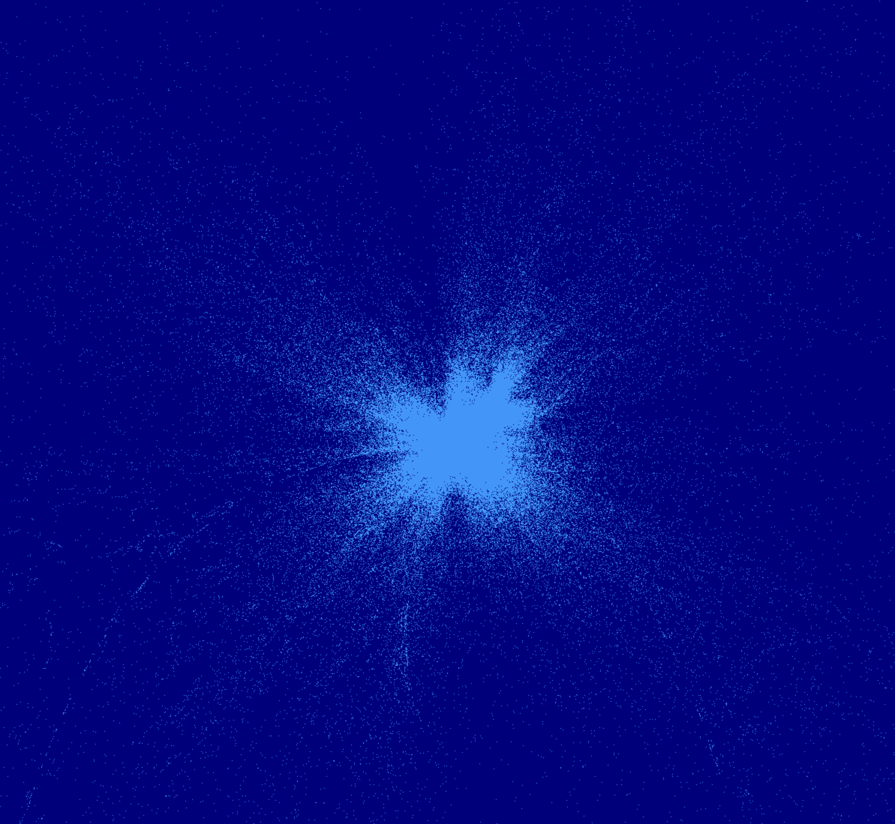
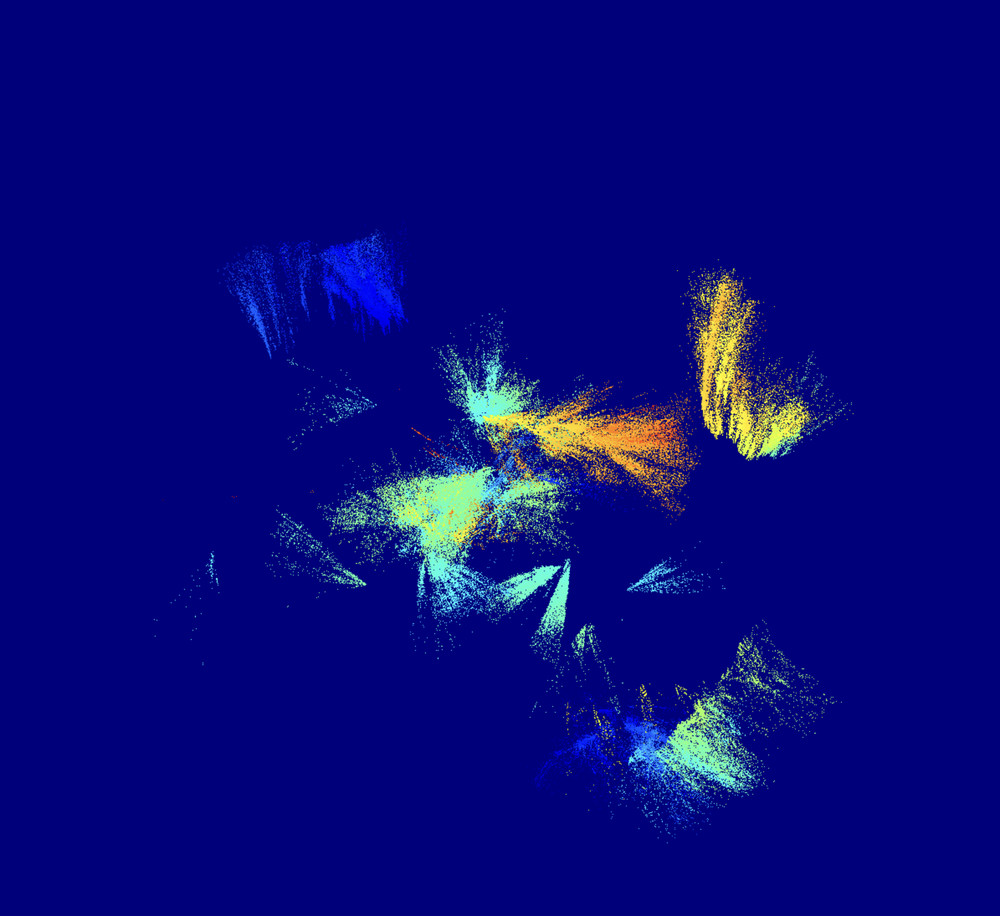

# Visual Odometry

The goal of this project is to implement visual odometry with a monocular camera. By identifying keypoints, tracking them across multiple frames, and using that information to estimate a transform between camera poses, we can determine a camera's motion.

To do this, we started by utilizing existing codebases to create a full pipeline that executed visual odometry. We proceeded to implement custom FAST and BRIEF code for keypoint identification and feature extraction respectively, as well as writing our the higher-level steps of visual odometry.

## Using the Code

Our project relies on both Python and C++ to run, with the C++ code build using CMake.
To run the code, ensure Python and CMake are both present on the system, as well as OpenCV for the C++ code. On Debian-based distributions, OpenCV can be installed with `sudo apt install libopencv-dev`.
Build the C++ code as follows:

```
mkdir build
cd build
cmake ..
make
cd ..
```

The C++ code can be tested by running the executable `./build/orb_demo`. If all works successfully, it should open the `/dev/video0` video device (typically the computer webcam) and draw keypoints on the image to show identified keypoints.

Our Python code also requires Pangolin (OpenGL library for visualization) be built and its Python bindings installed, which can be done following the instructions at https://github.com/uoip/pangolin. Other Python dependencies can be installed via the `requirements.txt` file with `pip install -r requirements.txt`.

With the dependencies installed, the main pipeline can be run with `python main.py`. This, by default, operates on the default camera stream `/dev/video0`. The source can be specified by the first command line argument after the script name: pass an int `X` to open the video device `/dev/videoX`, or pass a string to specify a relative path to an input video file. This will launch two windows, one of which displays a point cloud of recognized and triangulated keypoints together with camera frustums every frame, and the other of which consists of two adjacent frames of the video stream with a small number of keypoints matches highlighted via connecting the keypoints on each frame to each other.

Note that the camera intrinsics are currently hardcoded as the matrix K, and will need to be changed for other video sources to be perfectly accurate.

Additionally, passing a second, non-zero command line argument after the video source will specify that the algorithm should use OpenCV's ORB implementation, rather than our own.

Our pipeline can also be compared to the existing pipeline we built off of by running `python third_party/slam.py third_party/test.mp4`. Note that the scripts within `third_party/` are not ours, and were taken from the [https://github.com/Akbonline/SLAMPy-Monocular-SLAM-implementation-in-Python?tab=readme-ov-file](SLAMPy-Monocular-SLAM-implementation-in-Python) repository on GitHub, which did not include a license. Our changes to these scripts have been minimal and consisted of adding print statements for debugging purposes. Additionally, we used the `test.mp4` video file in this repository for testing purposes.

## Code Overview

In this project, we implement visual odometry. As a high-level overview, visual odometry aims to use subsequent image frames from a camera to estimate how the camera has moved in space between frames, allowing the trajectory of the camera to be estimated. Along with this, a 3D point cloud of recognized keypoints can be assembled by projecting points from each camera frame into the world frame.

<p align="center">
  
</p>

Our own learning goals included understanding the primary components of visual odometry from the ground up; for this reason, we chose to specifically implement certain key parts of the algorithm ourselves, rather than rely on functions already provided by OpenCV that do the same for us.

The structure of our code is as follows:

- Extract keypoints and descriptors from an image frame. Keypoints are visually identifiable elements of the image (typically corners, for instance) that can be tracked between frames, while descriptors are objects that attempt to uniquely describe a keypoint such that comparison of descriptors can serve as a metric for distinguishing which keypoints between frames are actually the same keypoint in space. For our implementation, we use FAST to extract keypoints and BRIEF to generate descriptors, implement both of these algorithms from scratch in C++, and access it from our Python code via Pybind11.
- Match keypoints between frames by their descriptors. The BRIEF descriptor is composed of binary comparisons, and can thus be quickly compared to another BRIEF descriptor via summing a bitstring after an XOR operation, which gets the Hamming distance (number of different bits) to use as an error metric. We obtain the two best matches and filter out points that don't clearly have a best match (i.e. the second best match is almost as good.)
- Compute the camera pose update. We first can compute a fundamental matrix describing the mapping between keypoints between frames, account for the camera intrinsic parameters (focal lengths and image centers) to get the essential matrix, and construct a 4x4 transformation matrix via SVD and some other manipulation of the essential matrix. The resulting transform consists of a 3x3 rotation matrix and 3x1 translation vector, concatentated into a 4x4 matrix.
- Triangulate the keypoints in space given the current camera pose (camera pose is our transformation matrix times the previous camera pose). If the keypoint is the same as one we recorded for the previous frame, ignore it for drawing --- we don't want to draw it again.
- Visualize our point cloud of keypoints by drawing them in space together with the camera poses.

We don't do any sort of map optimization after the fact, as would occur in any full SLAM implementation --- instead, keypoints drawn in the previous frame are constant, as is the previous pose.

## Algorithms

### FAST

FAST is an acronym for Features from Accelerated Segment Test. First proposed in the paper "_Machine learning for high-speed corner detection_," FAST is designed as a computationally efficient keypoint finding algorithm, compared to similar keypoint detection methods. This allows for a number of real-time applications, such as SLAM, to be significantly more viable.

The core of the FAST algorithm is that the algorithm considers each pixel in an image, comparing the pixel's intensity to a circle of surrounding pixels. If a sufficient number (we used 12) of consecutive pixels in the circle are all brighter than the center pixel or all darker, the algorithm determines the pixel to be a keypoint.

We also implemented a couple improvements to this core logic:

1. Only pixels whose circles will not go past the edge of the image will be considered. This is necessary to avoid undesired behavior from points that would be attempting to access pixel data that is outside of the camera frame.
2. Our algorithm first checks the pixels in the cardinal directions relative to the proposed keypoint pixel. This allows for pixels that are not potential corners to be discarded much more quickly.

### BRIEF

BRIEF is an acronym for Binary Robust Independent Elementary Features. First proposed in the paper "_BRIEF: Binary Robust Independent Elementary Features_," BRIEF takes in a list of keypoints and outputs matching bitstrings designed to encode the features of each individual keypoint. Like FAST, BRIEF is designed to be computationally efficient, taking advantage of the low overhead required to find the Hamming distance between two bitstrings, which allows for quick comparisons during keypoint matching.

For each keypoint, BRIEF works by considering a circular patch of pixels around the keypoint. Next, BRIEF picks pairs of pixels and compares the intensities of two pixels, P and Q, chosen by a random distribution. If Q's intensity is greater than P's, BRIEF adds a 1 to the keypoint's bitstring. Otherwise, a zero is added.

By assigning a bitstring descriptor for each keypoint, the similarity between two keypoints can be quickly calculated by simply finding the Hamming distance between two bitstrings with the sum of an XOR operation across the two bitstrings. Below, we've attached a demo of our BRIEF descriptor in action --- the lines represent a subset of the feature matches performed, matching a keypoint on one frame with a keypoint on the next.

<p align="center">
  
</p>

<!--
The BRIEF algorithm starts by attempting to normalize the orientation of an image.  We can then map the keypoint's
-->

The BRIEF algorithm starts by attempting to normalize the orientation of an image. This is done by calculating the centroid of an image. <!--Have image of centroid equation--> The centroid is made of up the moments of an image. <!--Have image of moment equation--> Conceptually, the centroid represents \_\_\_ and the moments represent a weighted average of the images pixel intensities across the image. We can then map the keypoint's -->

### ORB

ORB (Oriented FAST and Rotated BRIEF) is a combination of FAST and BRIEF with some slight changes.

The most important modification is the inclusion of orientation correction. Orientation correction is done by finding a principal orientation and rotating to align with a common orientation. To do this, we start by calculating the centroid of a keypoint patch.

```math
C_x = \frac{m_{10}}{m_{00}} \quad , \quad C_y = \frac{m_{01}}{m_{00}}
```

The centroid is made up of the moments of an image.

```math
m_{00} = \sum_{x,y \in P} I(x,y), m_{10} = \sum_{x,y \in P} x \cdot I(x,y), m_{01} = \sum_{x,y \in P} y \cdot I(x,y)
```

Conceptually, the centroid represents the image's place of greatest intensity and the moments represent a weighted average of the image's pixel intensities across the image. Subtracting the x and y positions of the keypoint from the centroid's x and y position gives a vector from the keypoint to the centroid. The inverse tangent of this vector gives an angle, which is useful for determining a rotation matrix that can be applied to align the patch with the centroid. This process makes ORB rotation-invariant (accounts for rotation when creating the bitstring descriptors).

Once the algorithm reaches BRIEF, it doesn't generate a random distribution of pairs, but uses a fixed set of values.

### Triangulation

Triangulation is the process of taking the same points in two different camera frames and using the orthogola properties of a cross product to map those points into 3D space in the world frame (usually relative to initialization).

The process begins by defining two matrices, $P_1$ and $P_2$, which map a point in 3D space to the 2D equivalent. The P matrices are $3\times4$ matrices.

```math
x = P_1X
```

```math
x = P_2X
```

Since we know the point P1X and x live on the same dimension we can redefine this equality using the cross product.

```math
x \times P_1X = 0
```

```math
x \times P_2X = 0
```

This form is great since it maps the same point in both frames. Now we need to find a form we can actually solve it in using SVD. Define $u_1$ and $v_1$ as the 2d coordinates of a point in camera frame 1, and $u_2$ and $v_2$ as the 2d coordinates of **the same point** in camera frame 2. Then we can use some linear algebra properties to expand our equation into:

<p align="center">
  
</p>

Using SVD, we can now solve for $x = [X, Y, Z, 1]^T$ for every point between the frames. These 3D coordinates directly correspond to the map we are seeking to create via this algorithm.

## Challenges and Takeaways

In implementing certain parts of the visual odometry pipeline, we ran into a number of challenges and bugs, some of which we were able to resolve. After working past or around these, we also generated a list of takeaways and plans for how to better pursue a similar project in the future.

### Challenges

#### Performance

As of now, our code does not function particularly well when measured against the third-party implementation as a benchmark. We added a helper function computing the reprojection error for a single frame, and measured the third-party implementation to have a root mean square error of slightly over 0.1. We measured our code to have a RMS reprojection error that averaged 1.75 over 45 frames, roughly an order of magnitude higher than the third-party implementation, when using our own matching, pose estimate, and triangulation yet OpenCV's ORB. Using our own ORB implementation on top of this, we get significantly worse values --- at some frames, we have RMS error of about 5 or 10, while a few significantly bad matches lead to extremely high error, driving the average up to over 100 at points. Further work could include throwing out pose updates with sufficiently bad reprojection error and keeping the better ones, but the presence of these outliers alone demonstrates the issues with the from-scratch ORB implementation.

From this, we conclude that our pipeline, excepting ORB, may not be significantly wrong --- the error is notably greater, but we also refrain from doing the optimization with g2o that the third party pipeline uses, possibly explaining our difference. Slight errors in the pipeline may also contribute to the reprojection error being greater, but the visual progression of the camera pose appears fairly accurate --- in the test video of a car driving down the road, the pose frustums appear to follow the path fairly accurately, and when looking at a static wall via the computer webcam, the camera poses drift slowly but mostly at random. However, the determination of keypoints in poorly-defined environments also ends up difficult, with there being some cases where too few points are passed into RANSAC, which determines the fundamental matrix. Adjusting the tolerance when matching as a function of the number of keypoints or extent of matching would be helpful in this case, but wasn't implemented in the interest of time.

#### ORB

One of two major issues we overlooked when implementing ORB was not initially handling edge cases nicely when generating descriptors --- if we tried to sample a point outside the bounds of the image, we would move to the next keypoint in the loop, yet keep the previous descriptor at its default value of zero. This resulted in any keypoints within 16 pixels of the image boundary having an identical descriptor and erroneously matching with each other exactly. Integrating this with the matching visualization code was helpful in showing us this erroneous matching in action and letting us debug it.

Trying figure out why so many descriptors were zero, we realized we made another mistake, allocating only half as many ints as were needed to specify the X and Y coordinates of 256 different pairs of points, used by the BRIEF descriptor generation. This resulted in out-of-bounds reads for all our latter points in any pair, which, by chance, almost always gave us comparisons of zero, causing our descriptors to fail to convey any useful information. Once we realized this, we easily fixed it by doubling the number of ints in the uniform random int array.

One minor challenge was integrating the ORB implementation, written in C++, to the rest of our project in Python. As we hadn't recognized a benefit in using ROS2 or any other middleware that abstracts the C++-to-Python communcation, we ended up learning the basics of Pybind11 for building a Python interface into a C++ function, which is useful to know.

#### Display

One major difficulty we ran into when developing our pipeline was the difficulty in writing our own code to display the point cloud, coupled with our difficulty in integrating our different pipelines together after visualization worked. The images below were from the alternate visualization, pose update, and triangulation pipeline present on the julian_test branch. While we did get the visualization to successfully display a point cloud, our mapping between keypoint matches and triangulated points was wrong at some phase, leading to these pretty but uninformative point clouds that did not accurately depict the test video. With more time, we would have integrated this visualization scheme with our main pipeline, as it has the most promising values for the camera pose update and triangulated point locations. However, we did not have the time to pull this visualization into our main branch.

<p align="center">
  
</p>
<p align="center">
  
</p>
<p align="center">
  
</p>

Rendering our point clouds and images proved to be consistently one of the most difficult parts of our implementation, given the different libraries and library wrappers used by the examples we found, as well as other assorted errors. Existing implementations we found used the Pangolin library for managing OpenGL display, which offers relatively easy support for rendering point clouds. However, two Python bindings for it exist, one of which could only be built with Python 3.10 or 3.9.

Additionally, we decided to use the Python wrapper for SDL2 for our own implementation given its versatility. However, when integrating the different components of our code, we consistently ran into segfaults when trying to access a SDL_Surface (and later, sometimes, SDL_Texture) object. This happened independent of our own C++-style code, and backtraces with GDB pointed to the segfault occurring from a function in the `libSDL2-2.0.so.0` library. The segfault would only occur when not running in the VSCode Python debugger, which made checking for null pointers difficult, and getting a more helpful backtrace from GDB would have required building Python and SDL2 with debug symbols, which we didn't think would be the most useful application of our time. The segfault would occur non-deterministically, and seemed tied to memory or some other hardware state --- on one occasion, we recorded 25 successful times running our program, and then a segfault on the 26th and a few subsequent times after that. This might be easier to debug if we were entirely in C++, but doing the project entirely in C++ would have been more effort than this change was worth.

We tried a few things, including moving code outside of classes or functions (maybe something was going out of scope?) and doing everything in the main thread, but did not find what was causing the error.

We've included some of the testing scripts we used for isolating what was causing the segfault and what wasn't in the `sdl2_test/` directory. Of these, `sdl2test.py` and `segfaults_not.py` never segfault, while `segfaults.py` does. 

While we never isolated the error, we haven't observed it for some time now in our `main.py` script, and would not be surprised if it's gone. However, we did not determine what exactly was causing the get surface or get texture to fail.

#### Takeaways

Our primary takeaway from this project is to not commit ourselves too heavily to testing existing implementations of VO, especially if doing so is not our end goal. Combined, we spent an excessive amount of time stitching together an existing implementation which we ultimately abandoned after deciding it was unlikely to have worked in the first place. This used up a large amount of time that could have been more productively spent integrating our own code with a pipeline that would work closer to out-of-the-box, or even trying to develop an implementation entirely from the ground up --- struggling to implement the dubious implementation wasn't as helpful to our own learning, and certainly not to our progress, as building off of a working one was. Similarly, we spent multiple hours trying to find the cause of a segmentation fault in the Python bindings for SDL2, a problem effectively unrelated to visual odometry, when we could have attempted to use a different library for visualizing.

In the future, we plan to be less wedded to the initial libraries and pieces of code we find, knowing that when these pieces of code give us trouble that seems unrelated to our own project work, we can probably find another implementation or library that would let us more quickly return to the actual content of the project.

We're resolved to be more conscious of the difficulty in integrating different parts of the code together in the future --- while we initially sought to follow good practice with feature branches and pulling into main after testing, we ended up spending almost all of our time working in separate branches, only integrating the different features near the end of the project. While the C++ code was relatively easy to integrate after writing a few wrapper functions for converting between Numpy and C++ types, we ended up with two main visual odometry pipelines in two different branches, and only had the time to integrate one of them into our main branch. To avoid this in the future, we plan on being more clear about deadlines along the course of the project, as well as what components we're each expecting each other to write. In our case, too much code for the main pipeline was developed in both branches and never integrated, leading to us having valuable code not pulled into our main branch and fully working.

We've also come to appreciate having more checks for invalid results in certain stages of the pipeline, given the time it took to catch a bug resulting in singular transform matrices. Ensuring the determinant of the transform is nonzero helps check this easily, but failing to do it led us to miss a typo in our processing of the fundamental matrix that was giving us singular matrices.

The project has been beneficial for all of us with regard to learning --- after completing this project, all of us are more familiar with the steps involved with visual odometry, and Connor in particular is able to appreciate the intricacies of the ORB keypoint matching algorithms. Julian and Ben both understand the implementation of keypoint matching more, and we all have more knowledge of how to determine a camera pose from keypoint matches and then use that transform to triangulate points. Julian has become more experienced with libraries for visualizing images and point clouds as well as converting between a fundamental and essential camera matrix, and Ben has learned to integrate C++ with Python. We've also all become more confident in using Git effectively, learning both from success as well as the slight lack thereof at times.

## Future Work

The logical next step for functionality of our program would include some sort of bundle adjustment for the poses and keypoints over time --- currently, we treat everything recorded in the previous frames as fixed, and do not correct them or optimize them. More sophisticated visual odometry, as well as SLAM, relies on continually optimizing the previous poses to minimize the total reprojection error (difference between predictions and observations of keypoints) across all recorded poses.

Another next step, however, would be refining our algorithm and testing to make sure it functions to an extent --- we're still not satisfied with the performance we have, both in terms of reprojection error as well as speed. Correcting our algorithm until we obtain a similar reprojection error to the third-party implementation is therefore a higher priority, as would be seeing what changes could be made to the C++ code to improve its speed --- we figure that OpenCV likely uses every optimization available to run quickly, but there are still likely approachable changes that we could make to our code to improve its speed.

We'd also like to pull the visualization from the julian_test branch into main, compare it to the existing pipeline, and potentially catch any issues in or our existing pipeline --- ideally, they should perform very similarly, and it would be nice to have our own visualization working.

## Other notes

### Contributions

This project was completed by Ben Ricket, Connor Hoang, and Julian Shah.

Connor implemented FAST, BRIEF, and ORB in C++ from scratch, and also set up a demo script demonstrating the performance of the from-scratch ORB compared to OpenCV's implementation. 

Julian implemented keypoint matching between frames and the corresponding visuals, as well as contributing to the camera transform and keypoint triangulation code. Julian also spent time making all of the visualizations work.

Ben integrated Connor's ORB implentation with Pybind11 and some helper functions to translate between Python and C++ types, and also contributed to the camera transform and keypoint triangulation code.

### External Resources

In addition to the included libraries, this project includes code from [https://github.com/Akbonline/SLAMPy-Monocular-SLAM-implementation-in-Python?tab=readme-ov-file](SLAMPy-Monocular-SLAM-implementation-in-Python), which does not list a license. All code taken from this repository is contained within the `third_party/` directory.
